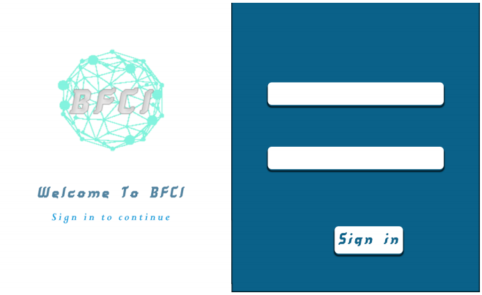
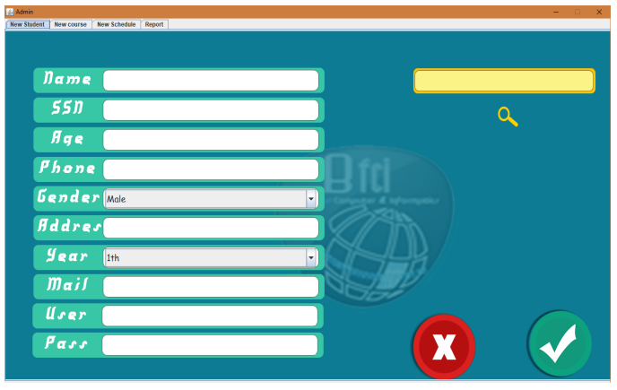
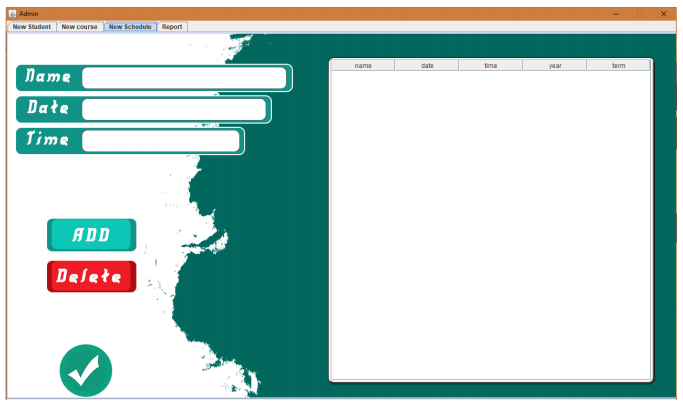
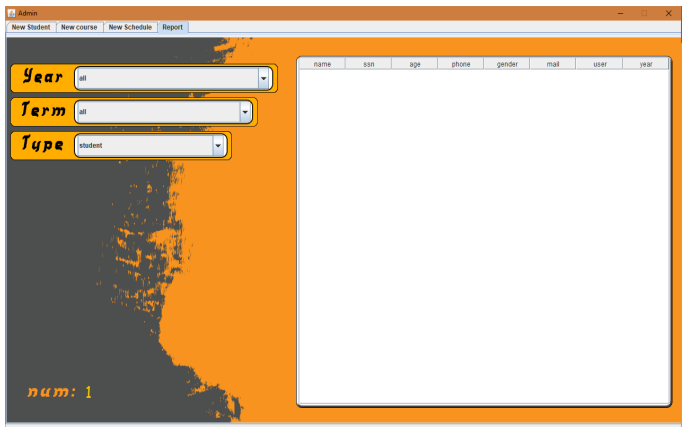
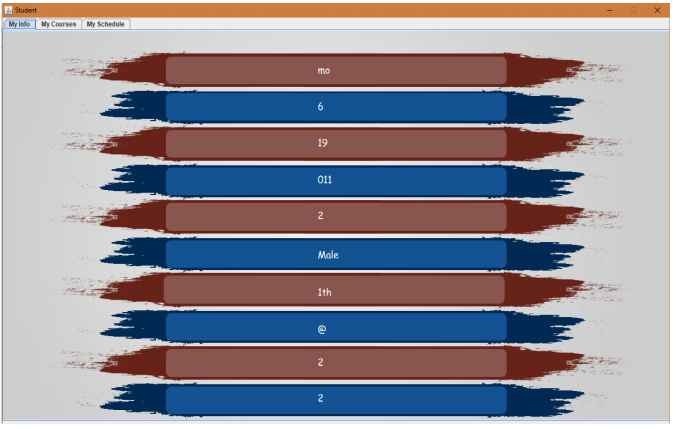
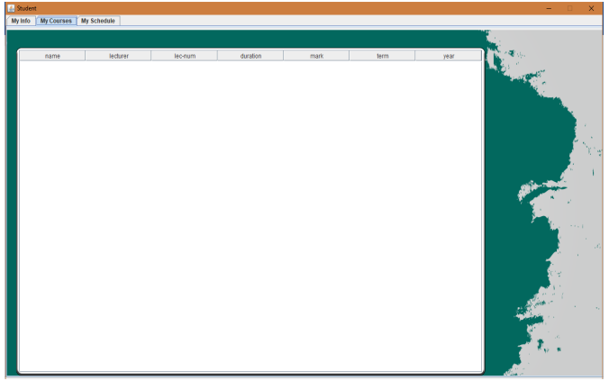
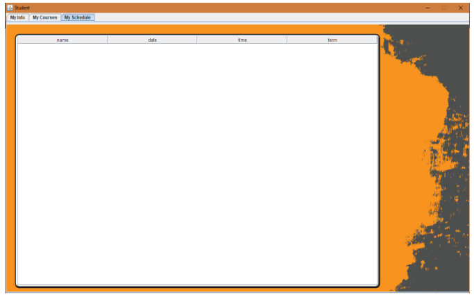

# College-Enrollment-System
It Provides Software Which Helps The College Management In Recording All The Information Regarding
Students And The Relevant Information Like Fees, Exam Schedule Etc.
It Gives Us Particular Data About How A Student Can Enroll To A College , With An Ease Of Use. The System Is User Friend And Is Less Time Consuming .
The Data Will Be Saved With In A Blink Of Time Into The Database.
It Also Generates Crystal Clear Reports For The Needed User

# Programming Languages used
Java With SQL Database

# Project
- When Running The Program This Form Will Appear And Who Can Login :-
  - 1.Admin
  - 2.Student
 

- First : The Admin.

  - The Admin Have A Unique Options That He Can Do What Ever He Want With The Data Base.

  - This Is What Will Appear When He Login : 4 Taps.

    - Add New Student
      - In This Tab The Admin Can Add New Student Information And Then He Can Modified It If There Where Any Error In The Data And He Can Delete The Data If He Want.
    
    
  
    - Add New Course
      - In This Tab The Admin Can Add New Course Data And He Can Search About The Course To Modified It And Remove It If He Didn’t Need It Any More. 
    
    
  
    - Add New Schedule
      - In This Tab The Admin Can Manage The Time And The Lecture And Fixed The Schedule And Modified Any Thing In It If There Where Any New Coming.
    
    
  
    - Report
      - This Report Can Give You An Overview About All Information In The Data Base Like The Data Of The Student ,The Courses ,And The Schedule Management.
    
    
    
- Second : Student

  - The Student Have A Limited Options That He Couldn’t Do Any Thing Except Seeing His Data.

  - This Is What Will Appear When He Login : 4 Taps.

    - Student Information
      - The Student Can Check His Data Which Was Added By The Admin.
    
       
      
    - Student Course
      - In This Tab The Student Can Check All The Courses That He Will Study In The Current Term.
      
      
      
    - Student Schedule
      - In This Tab The Student Can Know The Date Of The Exams And The Duration Of The Every Subject.
      
      
